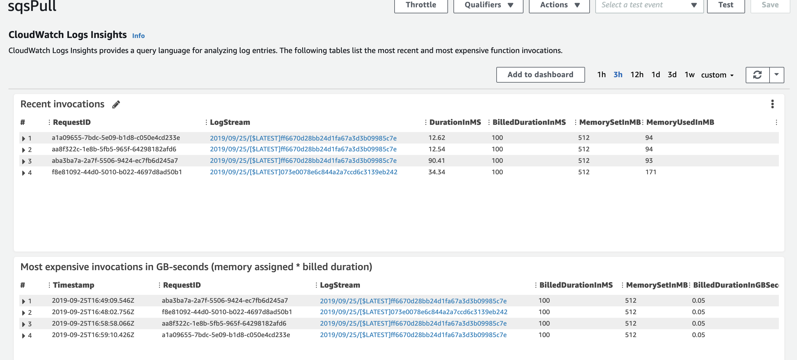
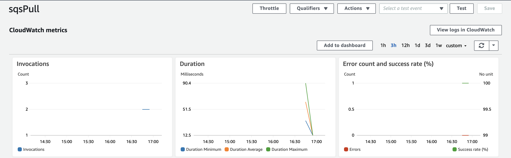
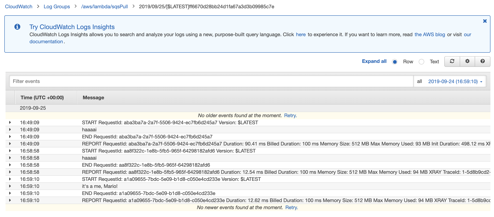

# SQS messaging
This is the java implementation of an sqs messaging system hosted on AWS.

## How to run this application
Create your own queue via the AWS SQS console.  Replace the queue name in this application with yours.

The messages can be displayed via a frontend with this [code](https://github.com/codefellows/seattle-java-401d5/tree/master/class-36/demo/logger).

After cloning that set of code, change the link, on line 18, within app.js to the link for your SQS.

This set of code has been deployed as a Lambda function.

You will need to set up your own lambda function to get proof of life. After connecting it to that lambda, click "Add trigger" and select the queue you're using.  Then enable the trigger.  Aftewards, head over to your IDE and run the Send class.  The messages will now show up in the CloudWatch logs, that are accessible from the lambda console under "Monitoring."

## Proof of life
How the charts look like after sending a message to the Q:

## Resources
[AWS Java SQS Tutorial](https://docs.aws.amazon.com/sdk-for-java/v1/developer-guide/examples-sqs-message-queues.html)

## Acknowledgements
This was done in collaboration with:

- Ginger the dog
- @Bombibear
- Sapana Poudel
- Nhu Trinh
- Joachen Busch
- Brandon Hurrington
- Renee Messick
- Travis Cox
- Jack Kinne
- Marisha Hoza
- Chris Coulon
- Matt Stuhring
- Nick Paro
- Melfi Perez
- Padmapriva Ganapathi